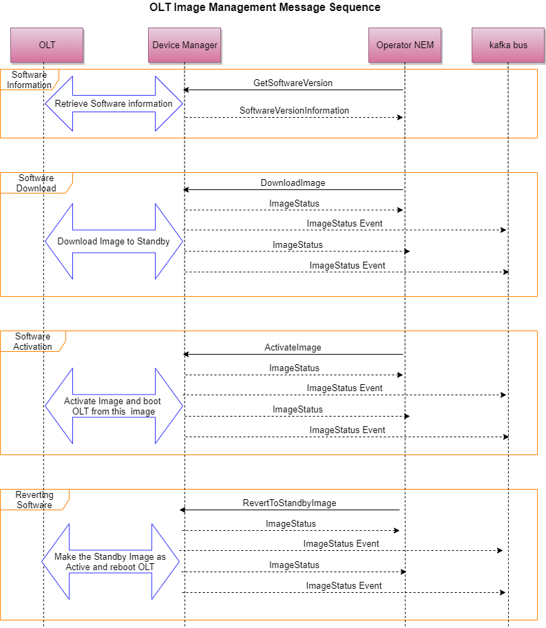

# Software Management

The software management that this interface addresses are for devices that can be managed over IP directly.

The below diagram shows the message flows for the different Image management RPCs.



``` protobuf
service NativeSoftwareManagementService {
    // Get the software version information of the Active and Standby images
    rpc GetSoftwareVersion(HardwareID) returns(SoftwareVersionInformation);

    // Downloads and installs the image in the standby partition, returns the status/progress of the Install
    rpc DownloadImage(DownloadImageRequest) returns(stream ImageStatus);

    // Activates and runs the OLT with the image in the standby partition. If things are fine this image will
    // henceforth be marked as the Active Partition. The old working image would remain on the Standby partition.
    // Any possibly required (sub-)steps like "commit" are left to the "Device Manager"
    rpc ActivateImage(HardwareID) returns(stream ImageStatus);

    // Marks the image in the Standby as Active and reboots the device, so that it boots from that image which was in the standby.
    // This API is to be used if operator wants to go back to the pervious software
    rpc RevertToStandbyImage(HardwareID) returns(stream ImageStatus);

    // This API can be used to let the devices pickup their properitary configuration which they need at startup.
    rpc UpdateStartupConfiguration(ConfigRequest) returns(stream ConfigResponse);
}
```
The download of the image always happens on the standby. As of now the support is for one active image/partition and one standby image/partition. The download procedure would encompass the download as well as installation of the image and also any required configurations to be applied.

The ActivateImage RPC always would activate the standby image/partition. This will trigger a reboot of the device to boot from the standby partition/image. After the boot of the new image, some tests are expected to run to validate if the activation was successful or not and only then would the image be committed. How such tests are run are upto the implementation of the device manager. If it's not able to activate the image, then it should fall back to the previous image automatically. This is especially important for devices which are in-band managed, as there is a possiblity that management plane could lose connectivity to the device in such a state.

The RevertToStandbyImage is different from ActivateImage; it assumes that the standby image/partition was already a working version and so it would not run the image activation sanity checks (the same checks which are run when during the ActivateIamge RPC) when booted from the standby image. This would help the human operator to intervene and break a loop if boot up tests keep failing.

As the image activation sanity checks are not run in this case, it is upto to operator to ensure that the image on the standby is a good working version. Additionally implementations can cross check if the image on the standby is a good already committed version else give an error response for this rpc.

The status of the download, activation or reverting are also sent to the kafka bus in addition to the return of the grpc stream. This would help other components in the system which would want to monitor the progress of such processes.

In the case when an OLT device gets upgraded; for other external systems like vOLTHA, it would just be a reboot of the OLT and should be handled exactly the same way. ***If*** OLT/adapter/agent implementations stores **presistent** config on the OLT then it needs to be ensured that this is available with the upgraded image so that vOLTHA does not see any difference compared to a reboot.

Some of the devices have the concept of a running and a startup configuration. The running configuration is what gets created/updated at runtime and would be dependant on what the Device Manager or VOLTHA asks the device to do. For these type of devices, every time the device boots up, it overrides it's running configuration with the startup configuration.
The API UpdateStartupConfiguration can be used to modify this startup configuration of the devices. Most of the standard running configuration would come from VOLTHA or the Device Manager, but there could/would be some properitary configuration that the devices need and this can be modified using this API.
