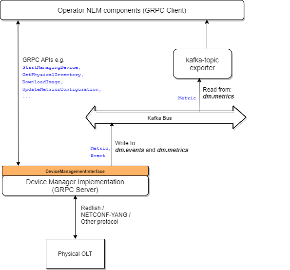

# Events and Metrics

The events and periodic metrics are asynchronously sent out by implementations of a Device Manager. A Device Manager implementing this interface should write these to a kafka bus.

Kafka has been chosen as a means to export from the device manager as it is suitable for handling asynchronous events. Persistence for the events and metrics can be easily achieved using kafka. Moreover kafka gives the flexibilites of handling and processing of the events and metrics by different/mulitple north-bound components/processes. Implementations could choose to have different services (with potentially multiple instances) handling the events and metrics.



The kafka topics to which these are written should be configurable at startup of the components, so that different deployments have the flexibility of choosing those.
The recomendation is to use **dm.events** for the events and **dm.metrics** for the metrics as the names of the kafka topics.

The two protobuf messages which would be used for this are:
``` protobuf
message Metric {
    MetricNames metric_id = 1;
    MetricMetaData metric_metadata = 2;
    ComponentSensorData value = 3;
}

message Event {
    EventMetaData event_metadata = 1;
    EventIds event_id = 2;
    google.protobuf.Timestamp raised_ts = 3;
    // Optional threshold information for an event
    ThresholdInformation threshold_info = 4;
    // Any additional info regarding the event
    string add_info = 5;
}
```
Note: The on-demand metrics query using the API `GetMetric` would be passed back over GRPC and not over the kafka bus.
