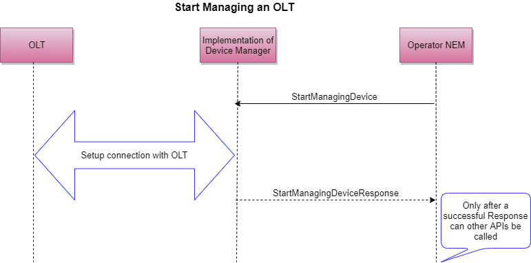

# Managing a device

The first API that a NEM would need to excute to start managing a hardware is the StartManagingDevice.

## StartManagingDevice

``` protobuf
service NativeHWManagementService {
    // Initializes context for a device and sets up required states
    // In the call to StartManagingDevice, the fields of ModifiableComponent which are relevant
    // and their meanings in this context is mentioned below:
    // name = The unique name that needs to be assigned to this hardware;
    // class = COMPONENT_TYPE_UNDEFINED;
    // parent = nil;
    // alias = Optional;
    // asset_id = Optional;
    // uri = IP Address of the Hardware;
    rpc StartManagingDevice(ModifiableComponent) returns(stream StartManagingDeviceResponse);
}
```
The `uri` is what would carry the IP address of the device and the `name` should be something that would uniquely identify the device.

On reception of this rpc, an implementation of Device Manager should validate the IP address and see if it can talk to/setup connection to the device or not. It should setup any required states that might be needed for it's internal implementation.

The NEM would wait for the `StartManagingDeviceResponse` before it will do any futher actions on this device. This response needs to contain the `uuid` assigned to this device. **For futher RPCs it would be the `uuid` that would be used to identify the device.**

*The device manager implementation should ensure that the `uuid` returned is universally unique and* ***does not change across reboots of the device.*** An example could be that the device manager first connects to the device and learns the serial number of the device and then uses this serial number to generate the `uuid` for the device.

## StopManagingDevice
``` protobuf
// Stop management of a device and clean up any context caches for that device
rpc StopManagingDevice(StopManagingDeviceRequest) returns(StopManagingDeviceResponse);
```
This RPC is to be used when a device is to be released from the system and no longer needs to be managed.

## GetPhysicalInventory
``` protobuf
// Get the HW inventory details of the Device
rpc GetPhysicalInventory(PhysicalInventoryRequest) returns(stream PhysicalInventoryResponse);
```

This RPC is used to retrieve the entire inventory of components of the Hardware. Again the caller has to wait on the response in a stream as implementations of Device Manager could take time to gather all this information.

## GetHWComponentInfo
``` protobuf
// Get the details of a particular HW component
rpc GetHWComponentInfo(HWComponentInfoGetRequest) returns(stream Component);
```
In the call to this RPC, both the `name` and the `uuid` of the component need to be passed in the `HWComponentInfoGetRequest`.

The `name` has to be unique for each of the components of the hardware and the `uuid` has to be universally unique. Implementation of Device Manager need to ensure this. Both of these two attributes are generated by the Device Manager.
## SetHWComponentInfo
``` protobuf
// Sets the permissible attributes of a HW component
rpc SetHWComponentInfo(HWComponentInfoSetRequest) returns(HWComponentInfoSetResponse);
```
In the call to this RPC, both the `name` and the `uuid` of the component need to be passed in the `HWComponentInfoSetRequest`.

Using this RPC, it is possible to modify the `name` of a component, and the Device Manager has to ensure that the name is unique, else it should return an error for this RPC. Although the `name` can be modified, it is recommended that NEM implementations do not do this because Device Managers and take advantage of this and come up with efficient implementations.


